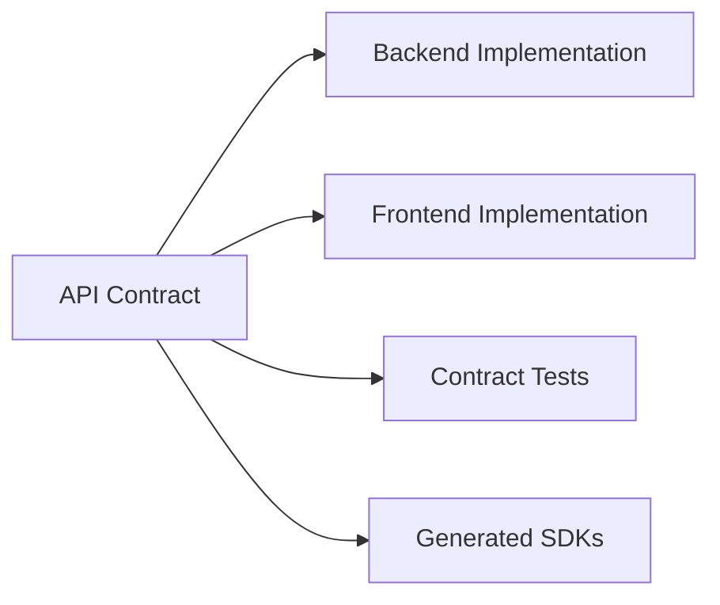

# API Design Principles for Framework Development

This skill provides guidance on designing APIs during Phase 3 (Planning) of framework development. It covers contract-first design, REST and GraphQL patterns, and how to create specifications that enable multi-agent development.

---

## CRITICAL: API Contracts are the Source of Truth

**The `03-api-planning/api-contracts.md` file is the SINGLE SOURCE OF TRUTH for all API endpoints.**

### Contract Guards (Prevents Wrong Endpoints)

Before implementing ANY endpoint:
1. **READ** `api-contracts.md` to get the exact specification
2. **MATCH** your implementation exactly (method, path, schema)
3. **NEVER** guess or assume an endpoint structure

Before calling ANY endpoint:
1. **READ** `api-contracts.md` to get the correct path
2. **USE** the exact path specified (no variations)
3. **VALIDATE** request/response against the schema

### Why This Matters

In long Claude Code sessions, context drift causes:
- "Guessing" endpoints that don't exist
- Using `/api/user` when contract says `/api/users`
- Missing required fields in requests
- Wrong HTTP methods (POST vs PUT)

**The fix: Always read the contract before writing code.**

---

## Contract-First Design

Define API contracts BEFORE implementation. This enables:
- Parallel development (frontend and backend work simultaneously)
- Clear boundaries for agent assignment (Phase 4)
- Automated testing against contracts
- Client SDK generation
- **Prevention of context drift errors**



---

## API Contract File Format

Create `03-api-planning/api-contracts.md` with this structure:

```markdown
# API Contracts

> ⚠️ **THIS FILE IS THE SOURCE OF TRUTH**
> Before implementing or calling any endpoint, read this file.
> Do not guess endpoints. Do not assume paths.

## Base Configuration
- Base URL: `/api/v1`
- Auth: Bearer token in `Authorization` header
- Content-Type: `application/json`
- All dates: ISO 8601 UTC

## Endpoints Index

| Method | Path | Description | Status |
|--------|------|-------------|--------|
| GET | /users | List all users | ✅ Implemented |
| POST | /users | Create user | ✅ Implemented |
| GET | /users/:id | Get user by ID | 🔄 In Progress |
| PUT | /users/:id | Update user | ⏳ Pending |
| DELETE | /users/:id | Delete user | ⏳ Pending |

---

## Endpoint Details

### GET /users

**Description:** List all users with pagination

**Authentication:** Required

**Query Parameters:**
| Param | Type | Required | Default | Description |
|-------|------|----------|---------|-------------|
| page | integer | No | 1 | Page number |
| limit | integer | No | 20 | Items per page (max 100) |
| sort | string | No | createdAt | Sort field |
| order | string | No | desc | Sort direction (asc/desc) |

**Response 200:**
```json
{
  "data": [
    {
      "id": "uuid",
      "email": "string",
      "name": "string",
      "createdAt": "ISO8601",
      "updatedAt": "ISO8601"
    }
  ],
  "meta": {
    "page": 1,
    "limit": 20,
    "total": 100,
    "totalPages": 5
  }
}
```

**Response 401:** Unauthorized
**Response 429:** Rate limited

---

### POST /users

**Description:** Create a new user

**Authentication:** Required (admin only)

**Request Body:**
```json
{
  "email": "string (required, valid email)",
  "name": "string (required, 2-100 chars)",
  "password": "string (required, min 8 chars)",
  "role": "string (optional, default: 'user', enum: ['user', 'admin'])"
}
```

**Response 201:** ← NOTE: 201, not 200
```json
{
  "data": {
    "id": "uuid",
    "email": "string",
    "name": "string",
    "role": "string",
    "createdAt": "ISO8601"
  }
}
```

**Response 400:** Validation error
**Response 401:** Unauthorized
**Response 409:** Email already exists

---
```

---

## REST API Design Principles

### Resource Naming

Use nouns for resources, not verbs:

```
Good:
  GET    /tasks          - List tasks
  POST   /tasks          - Create task
  GET    /tasks/{id}     - Get task
  PUT    /tasks/{id}     - Update task
  DELETE /tasks/{id}     - Delete task

Bad:
  GET    /getTasks
  POST   /createTask
  POST   /deleteTask
```

### HTTP Methods

| Method | Purpose | Idempotent | Safe |
|--------|---------|------------|------|
| GET | Retrieve resource | Yes | Yes |
| POST | Create resource | No | No |
| PUT | Replace resource | Yes | No |
| PATCH | Partial update | No | No |
| DELETE | Remove resource | Yes | No |

### URL Structure

```
/api/v1/{resource}/{id}/{sub-resource}/{sub-id}

Examples:
  /api/v1/projects/123/tasks
  /api/v1/users/456/preferences
  /api/v1/teams/789/members/101
```

### Query Parameters

For filtering, sorting, and pagination:

```
GET /tasks?status=active&priority=high&sort=-createdAt&page=1&limit=20

Conventions:
  - Filter:  ?field=value
  - Sort:    ?sort=field (ascending) or ?sort=-field (descending)
  - Page:    ?page=1&limit=20 or ?offset=0&limit=20
  - Fields:  ?fields=id,title,status (sparse fieldsets)
  - Include: ?include=assignee,project (related resources)
```

---

## Response Structure Standards

### Success Response Envelope

```json
{
  "data": {
    "id": "task-123",
    "type": "task",
    "attributes": {
      "title": "Implement login",
      "status": "active"
    }
  },
  "meta": {
    "requestId": "uuid"
  }
}
```

### List Response Envelope

```json
{
  "data": [
    { "id": "1", "name": "Item 1" },
    { "id": "2", "name": "Item 2" }
  ],
  "meta": {
    "page": 1,
    "limit": 20,
    "total": 100,
    "totalPages": 5
  }
}
```

### Error Response Structure

```json
{
  "error": {
    "code": "VALIDATION_ERROR",
    "message": "Invalid request",
    "details": [
      {
        "field": "email",
        "message": "Must be a valid email address"
      }
    ],
    "requestId": "uuid"
  }
}
```

---

## HTTP Status Codes

| Code | Meaning | When to Use |
|------|---------|-------------|
| 200 | OK | Successful GET, PUT, PATCH |
| 201 | Created | Successful POST with new resource |
| 204 | No Content | Successful DELETE |
| 400 | Bad Request | Malformed request syntax |
| 401 | Unauthorized | Missing or invalid auth |
| 403 | Forbidden | Valid auth but insufficient permissions |
| 404 | Not Found | Resource doesn't exist |
| 409 | Conflict | Resource state conflict |
| 422 | Unprocessable Entity | Validation errors |
| 429 | Too Many Requests | Rate limit exceeded |
| 500 | Internal Server Error | Server-side failure |

**⚠️ Important:** Document the EXACT status code for each endpoint in the contract. POST usually returns 201, not 200.

---

## Validation Rules

### Request Validation Template

Document validation in the contract:

```yaml
CreateUser:
  email:
    type: string
    required: true
    format: email
    maxLength: 255
    
  name:
    type: string
    required: true
    minLength: 2
    maxLength: 100
    pattern: "^[a-zA-Z ]+$"
    
  password:
    type: string
    required: true
    minLength: 8
    pattern: "^(?=.*[a-z])(?=.*[A-Z])(?=.*\\d).*$"
    
  role:
    type: string
    required: false
    enum: [user, admin]
    default: user
```

---

## Security Considerations

Document in the contract:

```yaml
endpoints:
  /api/v1/tasks:
    GET:
      auth: required
      scopes: [tasks:read]
    POST:
      auth: required
      scopes: [tasks:write]

  /api/v1/public/status:
    GET:
      auth: none

rateLimits:
  default:
    requests: 100
    window: 60s
    
  authenticated:
    requests: 1000
    window: 60s
    
  /api/v1/search:
    requests: 20
    window: 60s
```

---

## Contract Verification Process

### Before Implementation

1. Read `api-contracts.md` completely
2. Identify the endpoint to implement
3. Note: method, path, request schema, response schema, status codes
4. Implement EXACTLY as specified

### After Implementation

1. Run contract tests against the endpoint
2. Verify response matches documented schema
3. Verify status codes match documentation
4. Update contract status: ⏳ → 🔄 → ✅

### Integration Verification (Phase 6)

```bash
# Find all API calls in codebase
grep -r "fetch\|axios\|http" src/

# Verify each call matches contract
# Look for:
# - Correct HTTP method
# - Correct path
# - Correct request body structure
# - Correct response handling
```

---

## Phase 3 Integration Checklist

When defining APIs during framework planning:

- [ ] List all resources from Phase 2 module breakdown
- [ ] Define CRUD operations for each resource
- [ ] Map relationships between resources
- [ ] Document authentication requirements per endpoint
- [ ] Specify validation rules for all inputs
- [ ] Design error responses with consistent codes
- [ ] Plan pagination for list endpoints
- [ ] Version strategy decided and documented
- [ ] **Create api-contracts.md as source of truth**
- [ ] **Mark each endpoint status: ⏳ Pending**

---

## Agent Assignment Integration (Phase 4)

The API contract enables clean agent boundaries:

```markdown
## Agent Assignment from Contract

### Backend Agent
- Implements all endpoints in api-contracts.md
- Must match contract exactly
- Updates status: ⏳ → 🔄 → ✅

### Frontend Agent
- Reads api-contracts.md for correct paths
- Must not guess endpoints
- Reports contract mismatches immediately

### QA Agent
- Generates tests from contract
- Validates response schemas
- Tests error scenarios
```

---

## Common Contract Mistakes to Avoid

| Mistake | Problem | Fix |
|---------|---------|-----|
| `POST /users` returns 200 | Inconsistent with REST | Use 201 for creation |
| Missing pagination | List endpoints return all data | Add page/limit params |
| No error details | Client can't show specific errors | Add field-level errors |
| Guessing endpoints | Wrong paths in code | Always read contract first |
| Implicit schemas | Frontend assumes structure | Document every field |
| Missing auth requirements | Security gaps | Document auth per endpoint |

---

## API Contract Update Protocol

When the contract needs to change:

1. **Propose** the change with reasoning
2. **Check** for breaking changes (existing consumers)
3. **Update** the contract document first
4. **Notify** all agents using `shared-context.md`
5. **Update** implementation to match new contract
6. **Verify** all callers handle the change

---

## Quick Reference: Reading the Contract

When implementing code that calls an API:

```markdown
1. Open `.framework-blueprints/03-api-planning/api-contracts.md`

2. Find the endpoint in the Index table

3. Read the full endpoint details:
   - Method (GET/POST/PUT/DELETE)
   - Exact path (watch for plurals: /users not /user)
   - Query parameters (for GET)
   - Request body schema (for POST/PUT)
   - Response schema (what you'll receive)
   - Status codes (especially success code)

4. Implement using EXACTLY these details

5. Do not assume or guess any part
```

---

## GraphQL Contract Alternative

For GraphQL APIs, document in `api-contracts.md`:

```graphql
# Types
type User {
  id: ID!
  email: String!
  name: String!
  createdAt: DateTime!
}

# Queries
type Query {
  user(id: ID!): User
  users(page: Int, limit: Int): UserConnection!
}

# Mutations
type Mutation {
  createUser(input: CreateUserInput!): UserPayload!
}

# Inputs
input CreateUserInput {
  email: String!
  name: String!
  password: String!
}
```

---

## Research Before Finalizing

Before finalizing API design:

1. Search for "[Domain] API design best practices"
2. Review similar successful APIs in the space
3. Check framework-specific conventions (Express, FastAPI)
4. Validate security against OWASP API Top 10
5. Document decisions in ADRs
6. **Write everything to api-contracts.md**
