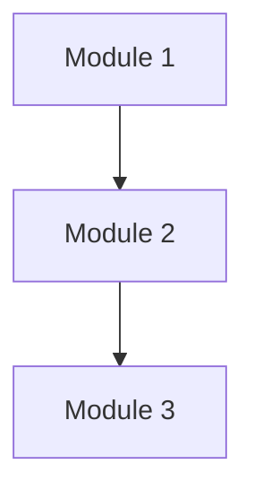
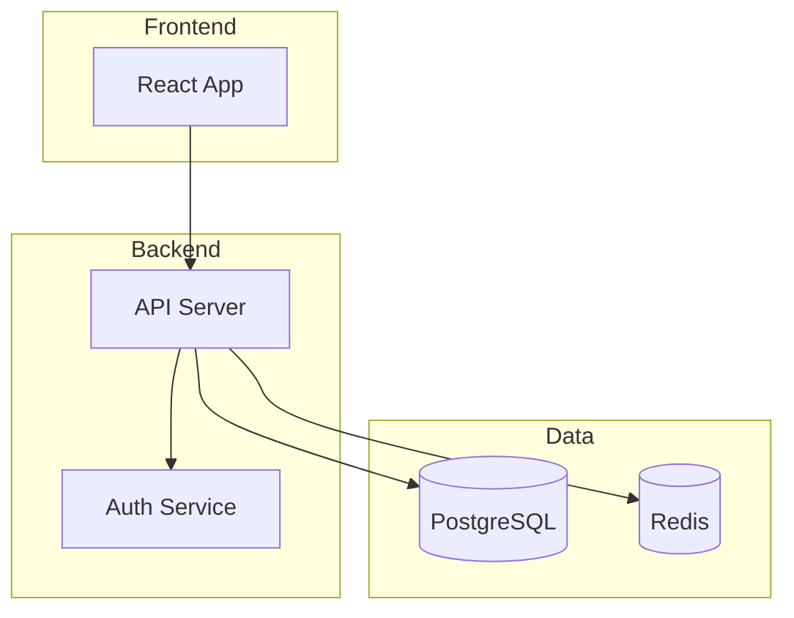
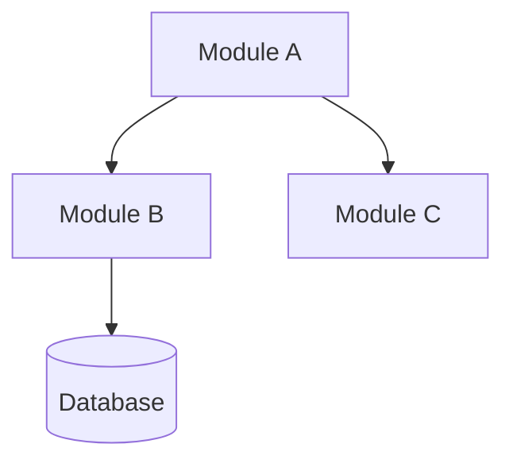
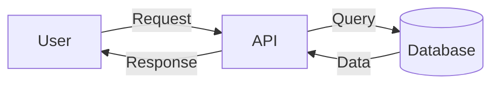
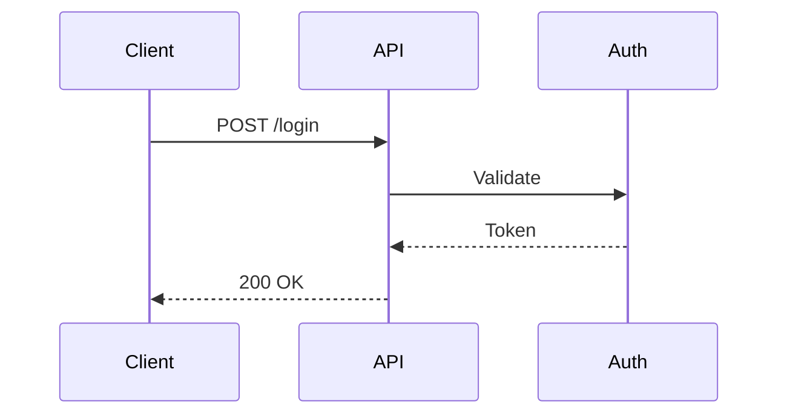

# Blueprint Generation for Framework Development

This skill provides templates and guidance for creating the comprehensive blueprint files that document project architecture, decisions, and implementation plans.

> **Related Skills:**
> - `handoff-protocol` - For detailed handoff document format (used in `05-execution/handoffs/`)
> - `project-state-management` - For state file structure and checkpointing

---

## Directory Structure

Initialize this structure at project start:

```
.framework-blueprints/
├── 00-project-state.json          # Master state file (source of truth)
├── 01-discovery/
│   ├── outline-v1.md              # Initial high-level outline
│   ├── outline-detailed.md        # Expanded bullet points
│   ├── architecture-diagram.md    # Mermaid diagrams
│   └── decisions-log.md           # Decisions with sources
├── 02-structure/
│   ├── module-hierarchy.md        # Complete module breakdown
│   ├── dependency-graph.md        # Module relationships
│   ├── risk-assessment.md         # Identified risks
│   └── verbal-links.md            # Connections in plain language
├── 03-api-planning/
│   ├── api-contracts.md           # All endpoints, schemas (SOURCE OF TRUTH)
│   ├── call-signs.md              # Verified module connections
│   └── coding-sequence.md         # Task order with dependencies
├── 04-agent-assignment/
│   ├── work-division.md           # How work is split
│   ├── llm-capabilities.md        # Research on each LLM
│   ├── assignment-matrix.md       # Which LLM → which tasks
│   └── prompts/                   # Tailored prompts for each agent
│       ├── backend-agent.md
│       ├── frontend-agent.md
│       └── qa-agent.md
├── 05-execution/
│   ├── progress-tracker.md        # Status dashboard (see handoff-protocol skill)
│   ├── shared-context.md          # Context all agents need
│   ├── state-summary-phase-5.md   # 50% checkpoint summary
│   └── handoffs/                  # Individual handoff files (format in handoff-protocol skill)
│       ├── HO-001-backend-to-frontend.md
│       └── HO-002-frontend-to-qa.md
└── 06-integration/
    ├── integration-checklist.md   # All verification checks
    ├── conflict-resolution.md     # Conflicts and resolutions
    ├── test-plan.md               # Integration tests
    └── final-report.md            # Complete project documentation
```

---

## File Templates

### 00-project-state.json

```json
{
  "projectName": "[Project Name]",
  "version": "1.0.0",
  "createdAt": "[ISO timestamp]",
  "updatedAt": "[ISO timestamp]",
  "currentPhase": 1,
  "phases": {
    "1": { "status": "in_progress", "startedAt": "", "progress": 0 },
    "2": { "status": "pending", "progress": 0 },
    "3": { "status": "pending", "progress": 0 },
    "4": { "status": "pending", "progress": 0 },
    "5": { "status": "pending", "progress": 0 },
    "6": { "status": "pending", "progress": 0 }
  },
  "decisions": [],
  "modules": [],
  "agents": [],
  "handoffs": [],
  "risks": [],
  "checkpoints": [],
  "criticalDetails": {
    "ports": {},
    "envVars": [],
    "nonStandardPaths": {},
    "apiQuirks": []
  }
}
```

---

### 01-discovery/outline-v1.md

```markdown
# Project Outline v1

**Project:** [Name]
**Created:** [Date]
**Status:** DRAFT | APPROVED

---

## Vision Statement

[One paragraph describing what this project does and why]

---

## Target Users

| User Type | Description | Key Needs |
|-----------|-------------|-----------|
| Primary | [Description] | [Needs] |
| Secondary | [Description] | [Needs] |

---

## Core Modules

### Module 1: [Name]
**Purpose:** [What it does]
**Responsibilities:**
- [Responsibility 1]
- [Responsibility 2]

### Module 2: [Name]
**Purpose:** [What it does]
**Responsibilities:**
- [Responsibility 1]
- [Responsibility 2]

---

## Initial Relationships



---

## Open Questions
- [ ] [Question 1]
- [ ] [Question 2]

---

## Approval

- [ ] User approved this outline on [date]
```

---

### 01-discovery/decisions-log.md

```markdown
# Decisions Log

All architectural and technical decisions with sources.

---

## Decision Template

### D001: [Decision Title]

**Date:** [ISO date]
**Phase:** 1
**Category:** Technology | Architecture | Process

**Context:**
[Why was this decision needed?]

**Options Considered:**
1. **[Option A]**
   - Pros: [list]
   - Cons: [list]
   - Source: [URL]

2. **[Option B]**
   - Pros: [list]
   - Cons: [list]
   - Source: [URL]

**Decision:**
[What was decided]

**Rationale:**
[Why this option was chosen]

**Consequences:**
- [Impact 1]
- [Impact 2]

---

## Decisions Index

| ID | Date | Title | Category |
|----|------|-------|----------|
| D001 | 2025-01-03 | Database Selection | Technology |
| D002 | 2025-01-03 | API Framework | Technology |
```

---

### 03-api-planning/api-contracts.md

```markdown
# API Contracts

> ⚠️ **THIS FILE IS THE SOURCE OF TRUTH**
> Before implementing or calling any endpoint, read this file.
> Do not guess endpoints. Do not assume paths.

---

## Base Configuration

- **Base URL:** `/api/v1`
- **Auth:** Bearer token in `Authorization` header
- **Content-Type:** `application/json`
- **All dates:** ISO 8601 UTC

---

## Endpoints Index

| Method | Path | Description | Status |
|--------|------|-------------|--------|
| GET | /users | List all users | ⏳ Pending |
| POST | /users | Create user | ⏳ Pending |
| GET | /users/:id | Get user by ID | ⏳ Pending |

**Status Legend:** ⏳ Pending | 🔄 In Progress | ✅ Implemented

---

## Endpoint Details

### GET /users

**Description:** List all users with pagination

**Authentication:** Required

**Query Parameters:**
| Param | Type | Required | Default | Description |
|-------|------|----------|---------|-------------|
| page | integer | No | 1 | Page number |
| limit | integer | No | 20 | Items per page |

**Response 200:**
```json
{
  "data": [
    {
      "id": "uuid",
      "email": "string",
      "name": "string",
      "createdAt": "ISO8601"
    }
  ],
  "meta": {
    "page": 1,
    "limit": 20,
    "total": 100
  }
}
```

**Error Responses:**
- 401: Unauthorized
- 429: Rate limited

---
```

---

### 05-execution/progress-tracker.md

> **Note:** For individual handoff document format, see the `handoff-protocol` skill.
> This progress tracker is a dashboard showing status of all agents and handoffs.

```markdown
# Execution Progress Tracker

**Last Updated:** [timestamp]

---

## Agent Status Dashboard

| Agent | LLM | Status | Progress | Current Task | Blocker |
|-------|-----|--------|----------|--------------|---------|
| BE-01 | Claude Sonnet | 🟢 Active | 60% | User API | None |
| FE-01 | GPT-4o | 🟡 Waiting | 0% | - | API Ready |
| QA-01 | DeepSeek | ⚪ Pending | 0% | - | FE Ready |

**Status Legend:** 🟢 Active | 🟡 Waiting | 🔴 Blocked | ⚪ Pending | ✅ Complete

---

## Task Progress

### Phase 5 Tasks

| ID | Task | Agent | Status | Started | Completed |
|----|------|-------|--------|---------|-----------|
| T-001 | Auth module | BE-01 | ✅ | 10:00 | 11:30 |
| T-002 | User CRUD | BE-01 | 🔄 | 11:45 | - |
| T-003 | Login UI | FE-01 | ⏳ | - | - |

---

## Handoff Status

| ID | From | To | Status | Notes |
|----|------|-----|--------|-------|
| HO-001 | BE-01 | FE-01 | Pending | Waiting on T-002 |

> For detailed handoff documents, see `05-execution/handoffs/HO-*.md`
> For handoff document format, see the `handoff-protocol` skill.

---

## Blockers

| Blocker | Blocking | Since | Resolution |
|---------|----------|-------|------------|
| API not ready | FE-01 | 11:00 | ETA 14:00 |

---

## Metrics

- Tasks completed: 1 / 10
- Estimated completion: 18:00
- Blockers resolved: 0 / 1
```

---

### 06-integration/final-report.md

```markdown
# Final Project Report

**Project:** [Name]
**Generated:** [Date]
**Version:** 1.0.0

---

## Executive Summary

[Brief overview of the project and what was built]

---

## Architecture Overview



---

## Modules Delivered

| Module | Description | Status | Files |
|--------|-------------|--------|-------|
| Auth | JWT authentication | ✅ Complete | 12 |
| Users | User management | ✅ Complete | 8 |
| API | REST endpoints | ✅ Complete | 15 |

---

## API Summary

| Endpoint | Method | Description |
|----------|--------|-------------|
| /api/v1/auth/login | POST | User login |
| /api/v1/users | GET | List users |
| /api/v1/users | POST | Create user |

Full details: `03-api-planning/api-contracts.md`

---

## Key Decisions

| ID | Decision | Rationale |
|----|----------|-----------|
| D001 | PostgreSQL | Relational data, strong consistency |
| D002 | JWT auth | Stateless, scalable |

Full details: `01-discovery/decisions-log.md`

---

## Deployment

### Environment Variables
| Variable | Description | Required |
|----------|-------------|----------|
| DATABASE_URL | PostgreSQL connection | Yes |
| JWT_SECRET | Token signing key | Yes |
| REDIS_URL | Cache connection | No |

### Commands
```bash
npm install
npm run build
npm start
```

---

## Next Steps

1. [ ] Deploy to staging
2. [ ] Load testing
3. [ ] Security audit
4. [ ] Production deployment

---

## Team

| Agent | LLM | Contribution |
|-------|-----|--------------|
| BE-01 | Claude Sonnet 4 | Backend API |
| FE-01 | GPT-4o | Frontend UI |
```

---

## Naming Conventions

### Files

| Type | Pattern | Example |
|------|---------|---------|
| Outline | `outline-v{N}.md` | `outline-v1.md` |
| State summary | `state-summary-phase-{N}.md` | `state-summary-phase-5.md` |
| Handoff | `HO-{NNN}-{from}-to-{to}.md` | `HO-001-backend-to-frontend.md` |
| Agent prompt | `{role}-agent.md` | `backend-agent.md` |

### IDs

| Type | Pattern | Example |
|------|---------|---------|
| Decision | `D{NNN}` | `D001` |
| Handoff | `HO-{NNN}` | `HO-001` |
| Risk | `R{NNN}` | `R001` |
| Task | `T-{NNN}` | `T-001` |

---

## Mermaid Diagram Patterns

### Module Relationships


### Data Flow


### Sequence


---

## Quick Reference

### Creating Blueprints
1. Initialize directory structure
2. Create `00-project-state.json`
3. Add phase directories as needed
4. Use templates for each file type

### Updating Blueprints
1. Read current state first
2. Modify only what changed
3. Update timestamps
4. Verify links still work

### Phase Transitions
1. Complete all phase files
2. Update state to next phase
3. Create checkpoint if at 50%/100%
